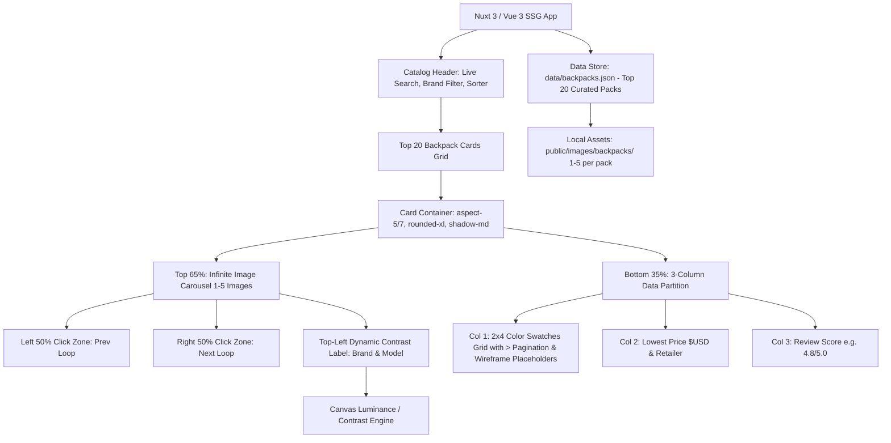

# Top 20 EDC Backpacks Digital Catalog - Implementation Plan

## Executive Summary
This project is a high-performance, visually refined digital catalog web application showcasing the **Top 20 Everyday Carry (EDC) Backpacks**. Each backpack is rendered as a tangible, poker-card-proportioned card (5:7 aspect ratio) with an interactive, infinite multi-image carousel (top 65% displaying 1 to 5 images), dynamic contrast text overlay, and a triple-partitioned data bar (bottom 35%) featuring an expandable **2x4 color swatch grid** with paginated "more" (`>`) navigation, lowest retailer price in $USD, and review score with denominator scale.

---

## Confirmed Architecture & Design Decisions

> [!IMPORTANT]
> **Confirmed Specifications:**
> 1. **2x4 Color Swatch Grid & Pagination:**
>    - Grid layout: **2 rows × 4 columns** (8 total cells).
>    - **$\le 8$ Colors:** Renders up to 8 swatches directly. If $< 8$ colors, empty slots render as subtle, muted wireframe placeholder circles to maintain exact geometric alignment.
>    - **$> 8$ Colors:** Renders the first 7 colors in slots 1–7, and a clickable **"More" (`>`) icon** in the 8th slot.
>    - **Seamless Looping:** Clicking `>` on the final page loops seamlessly back to Page 1.
> 2. **Overlay Label Position:**
>    - Positioned at the **top-left corner** (`absolute top-3 left-3 z-30 pointer-events-none`) of the top 65% image area with clean padding and subtle drop-shadow.
>    - Evaluates luminance under the overlay to dynamically switch text color between pure white (`#FFFFFF`) and pure black (`#000000`).
> 3. **Header & Search/Filter Controls:**
>    - Includes a glassmorphism header featuring live search (by brand or model name), brand dropdown filter, and sorting controls (price low-to-high / high-to-low, review score high-to-low, and capacity).
> 4. **Image Pipeline (1–5 Images per pack):**
>    - Max 5 images per backpack (targeting 5 downloaded images, with 1 being fully acceptable).
>    - Handled via local WebP/PNG assets in `public/images/backpacks/<id>/`.
> 5. **Framework & Local SSG:**
>    - Nuxt 3 with TypeScript and Tailwind CSS (`nuxt generate` for static output).

---

## Proposed Tech Stack & Architecture



---

## Curated Dataset Specification (Top 20 EDC Backpacks)

The dataset (`data/backpacks.json`) will feature 20 top EDC backpacks with diverse colorway counts (including packs with 10+ color options to exercise the 2x4 pagination system):

| # | Brand | Model | Capacity | Est. Price ($USD) | Key Retailer | Target Colors | Target Images |
| :- | :--- | :--- | :--- | :--- | :--- | :-: | :-: |
| 1 | **GORUCK** | GR1 21L (1000D Cordura) | 21L | $345 | GORUCK | 12 (Multi-page) | 5 |
| 2 | **Peak Design** | Everyday Backpack 20L V2 | 20L | $279 | Peak Design | 5 | 5 |
| 3 | **Aer** | City Pack Pro (Cordura/X-Pac) | 24L | $219 | Aer SF | 6 | 5 |
| 4 | **Mystery Ranch** | Urban Assault 21 | 21L | $149 | Mystery Ranch | 10 (Multi-page) | 5 |
| 5 | **Evergoods** | Civic Panel Loader 24L (CPL24) | 24L | $279 | Evergoods | 6 | 5 |
| 6 | **Bellroy** | Transit Workpack 20L | 20L | $199 | Bellroy | 7 | 5 |
| 7 | **Tom Bihn** | Synik 22 | 22L | $340 | Tom Bihn | 14 (Multi-page) | 5 |
| 8 | **Able Carry** | Daily Plus (X-Pac) | 21L | $198 | Able Carry | 5 | 5 |
| 9 | **Black Ember** | Citadel R3 | 25L | $275 | Black Ember | 3 | 5 |
| 10 | **Patagonia** | Black Hole Pack 25L | 25L | $149 | Patagonia / REI | 11 (Multi-page) | 5 |
| 11 | **The North Face** | Borealis Backpack | 28L | $99 | The North Face | 16 (Multi-page) | 5 |
| 12 | **Osprey** | Daylite Plus | 20L | $75 | Osprey / REI | 12 (Multi-page) | 5 |
| 13 | **Wandrd** | PRVKE 21L V3 | 21L | $219 | Wandrd | 7 | 5 |
| 14 | **Alpaka** | Elements Backpack Pro | 26L | $169 | Alpaka Gear | 6 | 5 |
| 15 | **Boundary Supply** | Errant Pack | 22L | $219 | Boundary Supply | 5 | 5 |
| 16 | **Chrome Industries** | Barrage Cargo | 22L | $180 | Chrome Industries | 6 | 5 |
| 17 | **Timbuk2** | Authority Laptop Backpack Deluxe | 28L | $159 | Timbuk2 | 6 | 5 |
| 18 | **Matador** | SEG28 Everyday Max | 28L | $250 | Matador | 3 | 5 |
| 19 | **Fjällräven** | Räven 20L | 20L | $110 | Fjällräven | 8 | 5 |
| 20 | **Topo Designs** | Rover Pack Classic | 20L | $99 | Topo Designs | 10 (Multi-page) | 5 |

---

## Component Architecture & Specifications

### 1. Card Geometry & Proportions
- **Aspect Ratio:** Standard poker playing card $2.5 : 3.5 = 5 : 7$ (`aspect-[5/7]`).
- **Responsive Constraints:** `min-w-[260px] max-w-[320px] w-full`.
- **Card Container:** `rounded-xl`, `border border-neutral-200 dark:border-neutral-800`, `shadow-md hover:shadow-xl transition-all duration-300`, `overflow-hidden`.

### 2. Top 65% Section — Infinite Carousel & Dynamic Label
- **Height Allocation:** Exactly `h-[65%] w-full relative overflow-hidden select-none`.
- **Infinite Carousel Engine (1 to 5 Images):**
  - Displays 1 primary image at a time.
  - **Left 50% Click Zone:** Previous image (infinite wrap: index $0 \rightarrow N-1$).
  - **Right 50% Click Zone:** Next image (infinite wrap: index $N-1 \rightarrow 0$).
  - Subtle pagination indicators (dots) on multi-image cards.
  - If `images.length === 1`, renders statically without looping controls.
- **Dynamic Contrast Label Overlay:**
  - Placed at **Top-Left**: `absolute top-3 left-3 max-w-[85%] z-30 pointer-events-none`.
  - Brand (uppercase, tracking-wider, text-xs font-semibold) + Model (text-sm font-bold leading-tight).
  - Canvas luminance analysis samples image pixels under label zone:
    $$L = 0.2126R + 0.7152G + 0.0722B$$
  - Chooses `#FFFFFF` or `#000000` for maximum WCAG contrast ratio.

### 3. Bottom 35% Section — 3-Column Data Partition
- **Height Allocation:** Exactly `h-[35%] w-full grid grid-cols-3 divide-x divide-neutral-200 dark:divide-neutral-800 bg-white dark:bg-neutral-900 px-2 py-2.5`.

#### Partition 1 (Bottom Left) — 2x4 Color Swatch Grid with Paginated `>` & Wireframe Placeholders
- **Grid Layout:** `grid grid-cols-4 grid-rows-2 gap-1 items-center justify-items-center h-full w-full`.
- **Pagination Logic:**
  - When total colors $\le 8$: Displays all colors; empty slots render as subtle wireframe placeholder circles (`w-4 h-4 rounded-full border border-dashed border-neutral-300 dark:border-neutral-700 opacity-40`).
  - When total colors $> 8$:
    - Page 1 shows 7 colors + `>` in slot 8.
    - Page 2 shows remaining colors (or next 7 + `>`).
    - Clicking `>` on the final page loops smoothly back to Page 1.
- **"More" (`>`) Button:**
  - Interactive 8th cell: `w-5 h-5 rounded-full flex items-center justify-center bg-neutral-100 hover:bg-neutral-200 dark:bg-neutral-800 dark:hover:bg-neutral-700 text-neutral-700 dark:text-neutral-200 text-xs font-bold transition-colors cursor-pointer`.
- **Swatch Cells:**
  - Rounded circular swatches (`w-4 h-4 rounded-full border border-black/15 dark:border-white/15 shadow-inner`).
  - Tooltip showing the colorway name on mouse hover.

#### Partition 2 (Bottom Middle) — Price & Retailer
- `flex flex-col items-center justify-center text-center px-1`.
- **Price:** `text-lg font-extrabold text-neutral-900 dark:text-white tracking-tight` (e.g. `\$219`).
- **Retailer:** `text-[11px] font-medium text-neutral-500 dark:text-neutral-400 truncate max-w-full` (e.g. `Aer SF`).

#### Partition 3 (Bottom Right) — Review Score with Denominator Scale
- `flex flex-col items-center justify-center text-center px-1`.
- **Score:** `text-sm font-bold text-neutral-900 dark:text-white` (e.g. `4.8/5.0` or `9.1/10.0`).
- Accompanying star icon accent.

---

## File Structure

```
edc-backpack-catalog/
├── assets/
│   └── css/
│       └── main.css                  # Tailwind styles and card utilities
├── components/
│   ├── BackpackCard.vue              # 5:7 poker card container
│   ├── CardCarousel.vue              # Top 65% infinite carousel (1-5 images)
│   ├── CardLabelOverlay.vue          # Dynamic white/black contrast label (top-left)
│   ├── CardBottomBar.vue             # Bottom 35% 3-column container
│   ├── ColorGrid.vue                 # 2x4 paginated color swatches grid with '>' button & wireframes
│   ├── PriceRetailer.vue             # Price ($USD) and retailer
│   ├── ReviewScore.vue               # Score with denominator scale
│   └── CatalogNavbar.vue             # Filter, search, and sort header
├── composables/
│   ├── useBackpackCatalog.ts         # Filtering and sorting logic
│   └── useImageContrast.ts           # HTML5 Canvas luminance calculation
├── data/
│   └── backpacks.json                # Top 20 curated backpacks (with extended colorways)
├── public/
│   └── images/
│       └── backpacks/                # 1-5 downloaded images per backpack
├── scripts/
│   └── fetch-backpack-images.mjs     # Image download & preparation script
├── types/
│   └── backpack.ts                   # TypeScript interfaces
├── nuxt.config.ts                    # Nuxt 3 configuration
├── tailwind.config.ts                # Tailwind CSS configuration
└── app.vue                           # Main application page
```

---

## Verification Plan

### Automated Tests
- TypeScript type checking: `npx nuxi typecheck`.
- Build verification: `npx nuxi generate` to confirm clean static build.
- Pagination Logic Unit Test: Verify that packs with 3, 8, 12, and 16 colorways paginate correctly and loop back cleanly.

### Manual Verification
1. **2x4 Color Swatch Grid & `>` Button:**
   - Backpacks with $\le 8$ colors: Displays swatches with wireframe circles for remaining empty slots; no `>` icon.
   - Backpacks with $> 8$ colors: Displays 7 swatches + `>` icon in the 8th position.
   - Clicking `>` advances to Page 2; clicking `>` on final page loops back to Page 1.
   - Hovering each swatch displays the colorway name tooltip.
2. **Top-Left Dynamic Contrast Overlay:** Confirm label sits cleanly at top-left and dynamically adapts between `#FFFFFF` and `#000000` based on underlying image brightness.
3. **Poker Card Geometry (5:7):** Inspect in DevTools to confirm cards maintain exact 5:7 proportions across viewports.
4. **Infinite Carousel (1-5 Images):** Click left/right halves to verify infinite looping and smooth transitions.
5. **Catalog Header:** Test live search, brand filtering, and sorting (price, score, capacity).
